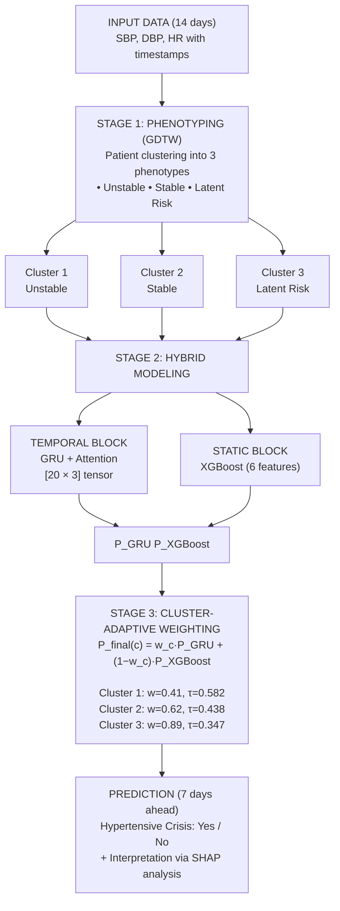

# Cluster-Adaptive Hybrid GRU-XGBoost Architecture for Predicting Hypertensive Crises

## Table of Contents

1. [Project Overview](#project-overview)
2. [Scientific Problem](#scientific-problem)
3. [Data](#data)
4. [EDA and Preprocessing](#eda-and-preprocessing)
5. [Methodology](#methodology)
6. [Model Architecture](#model-architecture)
7. [Results](#results)
8. [Interpretability](#interpretability)
9. [Project Structure](#project-structure)
10. [Installation and Running](#installation-and-running)

---

## Project Overview

**ClusterBP** is a cluster-adaptive hybrid architecture for predicting hypertensive crises based on remote blood pressure (BP) monitoring data. The system is validated on the largest real-world remote monitoring cohort: **11,739 patients** and **4.9 million BP measurements** from 19 Russian regions as part of the national "Personal Medical Assistants" (PMP) program.

The project addresses three key limitations of existing prediction systems:
1. **Small cohorts** — uses a real national program with broad phenotypic diversity.
2. **Fixed thresholds** — instead of a single SBP > 140 mm Hg threshold, personalized prediction is used.
3. **Lack of interpretability** — SHAP analysis ensures transparency of predictions for physicians.

---

## Scientific Problem

Hypertensive crises are life-threatening cardiovascular events whose precursors accumulate silently in BP dynamics days before clinical manifestation. The problem is formulated as binary classification:

> **Using BP data over 14 days (SBP, DBP, HR with timestamps), predict whether a hypertensive crisis will occur in the next 7 days.**

The system delivers interpretable one-week risk alerts, enabling proactive physician intervention before crisis onset.

---

## Data

### Data Sources

The analysis uses anonymized data from the federal pilot project "Personal Medical Assistants" (PMP), collected from November 2023 to December 2024 across 119 medical organizations in 19 constituent entities of the Russian Federation.

### Data Structure

| File | Description | Key Fields |
|------|-------------|------------|
| `Идентификаторы Субъектов 10.04.2025.csv` | Reference of RF regions | region id, region name |
| `Идентификаторы МО 15.04.2025.csv` | Reference of medical organizations | MO id, MO name |
| `МО и Пациенты 10.04.2025.csv` | Patient-program linkage | patient id, observation group, MO id |
| `Первичные данные от 10.04.2025.csv` | BP measurements | SBP, DBP, HR, height, weight, date/time, patient id |
| `Медикаментозная терапия от 10.04.2025.csv` | Prescribed therapy | patient id, INN, prescription date |
| `Клинически значимые события от 15.04.2025.csv` | Crisis events | patient id, event code, date |

### Final Cohort

| Parameter | Value |
|-----------|-------|
| Patients (analytical cohort) | 11,739 (19 regions, 119 MOs) |
| Primary BP measurements | 4,888,853 |
| Clinical event records | 1,243,036 |
| Pharmacotherapy records | 23,798 |
| Average measurements / patient | 673 |

### Crisis Event Codes (Positive Class)

- **33901** — crisis, unspecified
- **33900** — hypertensive crisis
- **33012** — hypertensive encephalopathy
- **33601** — hypertensive retinopathy
- **33801** — acute BP elevation

Proportion of positive examples in time window data: **41%**.

---

## EDA and Preprocessing

### Preprocessing Pipeline

1. **Deduplication and Outlier Removal**
   - Removed 78,000 duplicate records (same patient, same second)
   - Excluded 435 records with physiologically impossible values:
     - SBP ∉ [40; 250] mm Hg
     - DBP ∉ [30; 150] mm Hg
     - HR ∉ [30; 220] bpm

2. **Timezone Correction**
   - Measurements from five time zones converted to patient's local time
   - Without correction, 42.9% of measurements appeared as nighttime
   - After correction, nighttime readings reduced to 14% (consistent with expected behavior)
   - Morning (06:00-10:00) and evening (18:00-22:00) measurement peaks restored

3. **Missing Value Imputation**
   - Height and weight (missing for 45% of patients) — filled with stratum medians (observation group × age decile)
   - Diagnosis codes (missing for 60% of patients) — marked as "Not specified"
   - New features created: **BMI** and **pulse pressure**

4. **Patient Exclusion**
   - 361 patients excluded based on criteria:
     - BMI > 50 kg/m² (n = 23)
     - Fewer than three measurements in any 14-day window (n = 338)

### Target Variables

Three types of target variables created for ML tasks:

| Variable | Type | Description |
|----------|------|-------------|
| `target_high_risk` | Binary | 1 — if number of CSEs above median |
| `target_risk_category` | Multiclass | Low, Medium, High, Very High risk |
| Regression | Continuous | Absolute number of CSEs |

---

## Methodology

### Stage 1: Patient Phenotyping via GDTW

**GDTW (Generalized Dynamic Time Warping)** — a modified DTW algorithm incorporating temporal penalty:

> **Alignment Cost = (Value Difference)² + γ × (Temporal Shift / Window)²**

**Clustering Parameters:**
- Time window: **14 days** (maximum allowed shift)
- Gamma (γ): **1.0** (temporal penalty weight)
- Primary indicator: **SBP** (most clinically significant)

**7,389 patients** with continuous observation ≥ 30 days were selected for clustering. **~27.3 million pairs** of distances were computed using JIT compilation (Numba) for acceleration.

**Number of Clusters Selection:**
- Silhouette coefficient: maximum at k=2 (0.330)
- Elbow method: inflection at k=3
- **Final choice: k = 3** (clinically optimal compromise)

**Three Phenotypes:**

| Cluster | Size | Mean CSEs | Characteristics |
|:---|:---:|:---:|:---|
| **Cluster 1 — "Unstable"** | 815 | **242.9** | High crisis frequency, absence of dominant pattern, heterogeneous structure |
| **Cluster 2 — "Stable"** | 4,200 | **109.3** | Minimal event frequency, negative SBP trends (effective therapy) |
| **Cluster 3 — "Latent Risk"** | 2,374 | **171.1** | Intermediate frequency, positive SBP trends despite few complications — "hidden threat" |

**Statistical Validation:**
- One-way ANOVA of SBP trend: **F = 14.538, p < 0.0001**
- Pairwise t-tests with Bonferroni correction (adjusted α = 0.0167)

### Stage 2: Hybrid Modeling

**Features divided into two orthogonal blocks:**

| Block | Model | Features |
|-------|-------|----------|
| **Temporal** | GRU with soft-attention | Tensor [20 × 3]: 20 most recent measurements (SBP, DBP, HR) |
| **Static** | XGBoost | 6 scalar features: mean SBP, std SBP, TIR, age, BMI, cluster |

**GRU Architecture:**
```
BatchNormalization → GRU(64, dropout=0.20) → Soft Attention → GlobalAveragePooling1D → Dense(1, sigmoid)
```

**XGBoost Architecture:**
- 500 trees
- max_depth = 5
- learning_rate = 0.05
- scale_pos_weight = inverse class frequency ratio

### Stage 3: Cluster-Adaptive Weighting

Final probability:
> **P_final(c) = w_c · P_GRU + (1 − w_c) · P_XGBoost**

where c ∈ {1, 2, 3} is the patient's cluster, w_c is the cluster-specific GRU weight, and binary decision is made at threshold τ_c.

**Optimal Parameters (averaged across 5 folds):**

| Cluster | GRU Weight (w_c) | Threshold (τ_c) | Clinical Interpretation |
|:---|:---:|:---:|:---|
| 1 — Unstable | 0.41 | 0.582 | Equal contribution; noise limits GRU |
| 2 — Stable | 0.62 | 0.438 | GRU captures predictable dynamics |
| 3 — Latent Risk | 0.89 | 0.347 | GRU dominates; cyclicity is key signal |

**Important:** Hyperparameters (w_c, τ_c) were optimized strictly within the cross-validation loop with patient-level splitting to prevent data leakage.

---

## Model Architecture



---

## Results

### Five-Fold Cross-Validation (Macro F1, patient-level splitting)

| Fold | ClusterBP (ours) | Simple Ensemble | GRU only | XGBoost only |
|:---:|:---:|:---:|:---:|:---:|
| 1 | 0.8722 | 0.8531 | 0.8544 | 0.8260 |
| 2 | 0.8667 | 0.8477 | 0.8433 | 0.8431 |
| 3 | 0.8516 | 0.8395 | 0.8368 | 0.8350 |
| 4 | 0.8526 | 0.8360 | 0.8359 | 0.8227 |
| 5 | 0.8457 | 0.8270 | 0.8293 | 0.8073 |
| **Mean ± SD** | **0.858 ± 0.011** | 0.841 ± 0.010 | 0.840 ± 0.009 | 0.827 ± 0.014 |

### Performance Gain

| Comparison | ΔMacro F1 |
|-----------|:---:|
| ClusterBP vs Simple Ensemble | **+0.017** |
| ClusterBP vs GRU only | **+0.018** |
| ClusterBP vs XGBoost only | **+0.031** |
| ClusterBP vs Threshold classifier (SBP > 140) | **+0.34** (abs. p.) |

### Statistical Significance

| Comparison | t-test | Wilcoxon |
|-----------|:---:|:---:|
| ClusterBP vs Simple Ensemble | 0.0002 | 0.0625 |
| ClusterBP vs GRU only | 0.0003 | 0.0625 |
| ClusterBP vs XGBoost only | 0.0041 | 0.0625 |

### Final Results on Independent Test Set

| Class | Precision | Recall | F1-score |
|-------|:---:|:---:|:---:|
| Stable (negative) | 0.83 | 0.83 | 0.83 |
| Hypertensive crisis (positive) | 0.87 | 0.87 | 0.87 |
| **Macro average** | **0.85** | **0.85** | **0.851** |

**95% CI for Macro F1:** [0.843; 0.859] (1000 iterations of percentile bootstrap)

---

## Interpretability

### SHAP Analysis

Global SHAP values show:

| Feature Type | Contribution to Predictive Power |
|--------------|:---:|
| Dynamic trends (SBP and DBP slopes) | ~40% |
| Static aggregates (mean, std SBP) | ~16% |
| Cluster membership | ~8% |

**Key finding:** Dynamic BP trends are **2.5×** more informative than the best static feature.

### Clinical Insights by Cluster

| Cluster | SHAP Interpretation |
|---------|---------------------|
| **Cluster 1 — Unstable** | No single feature dominates → heterogeneous structure → higher XGBoost weight (w₁=0.41) |
| **Cluster 2 — Stable** | Strongly negative SBP trends → predictor of low risk → confirmation of effective therapy |
| **Cluster 3 — Latent Risk** | Positive SBP trends → early warning signal → inaccessible to fixed thresholds |

---

## Project Structure

```
├── data/
│   ├── primary_clean.csv                    # Cleaned primary data
│   ├── primary_imputed_corrected.csv       # Data with imputed missing values
│   ├── ml_dataset_final.csv                # Aggregated dataset
│   ├── ml_dataset_ready.csv                # FINAL dataset for ML
│   ├── ts_prepared_data.pkl                # Time series for GDTW
│   ├── ts_episodes.csv                     # Episodes for state classification
│   ├── gt_dtw_distance_matrix.npy          # GDTW pairwise distance matrix
│   ├── clustering_patients_updated.pkl     # Patient list for clustering
│   ├── clustering_results.csv              # Cluster labels
│   ├── clustering_results.pkl              # All clustering results
│   └── photo/                              # All visualizations
│       ├── ts_clustering_examples.png
│       ├── gt_dtw_distance_matrix.png
│       ├── dendrograms_comparison.png
│       ├── optimal_k_analysis.png
│       ├── cluster_centroids.png
│       └── cluster_representative_patients_normalized_time.png
│
├── Presentations/
│   ├── EDA_presentation.pdf
│   ├── EDA.pdf
│   ├── GDTW_presentation.pdf
│   └── GDTW.pdf
│
├── Downloads/                              # Source CSV files (not in repository)
│   ├── Идентификаторы Субъектов 10.04.2025.csv
│   ├── Идентификаторы МО 15.04.2025.csv
│   ├── МО и Пациенты 10.04.2025.csv
│   ├── Первичные данные от 10.04.2025.csv
│   ├── Медикаментозная терапия от 10.04.2025.csv
│   └── Клинически значимые события от 15.04.2025.csv
│
└── README.md
```

---

## Installation and Running

### Requirements

- Python 3.11+
- TensorFlow 2.14+
- XGBoost 2.0+
- SHAP 0.44+
- scikit-learn
- pandas, numpy, matplotlib, seaborn
- Numba (for GDTW acceleration)

### Install Dependencies

```bash
pip install tensorflow==2.14.0 xgboost==2.0.0 shap==0.44.0 scikit-learn pandas numpy matplotlib seaborn numba
```

### Run EDA and Preprocessing

```python
# Sequential execution of all processing stages
# (code files should be in the root directory)

python 1_load_and_validate_data.py
python 2_clean_and_preprocess.py
python 3_eda_analysis.py
python 4_impute_missing_values.py
python 5_create_ml_dataset.py
```

### Run GDTW Clustering

```python
python 6_gdtw_clustering.py
```

---